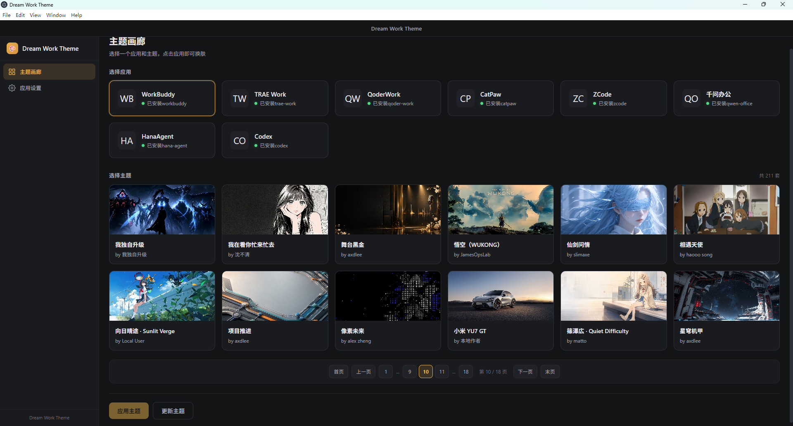
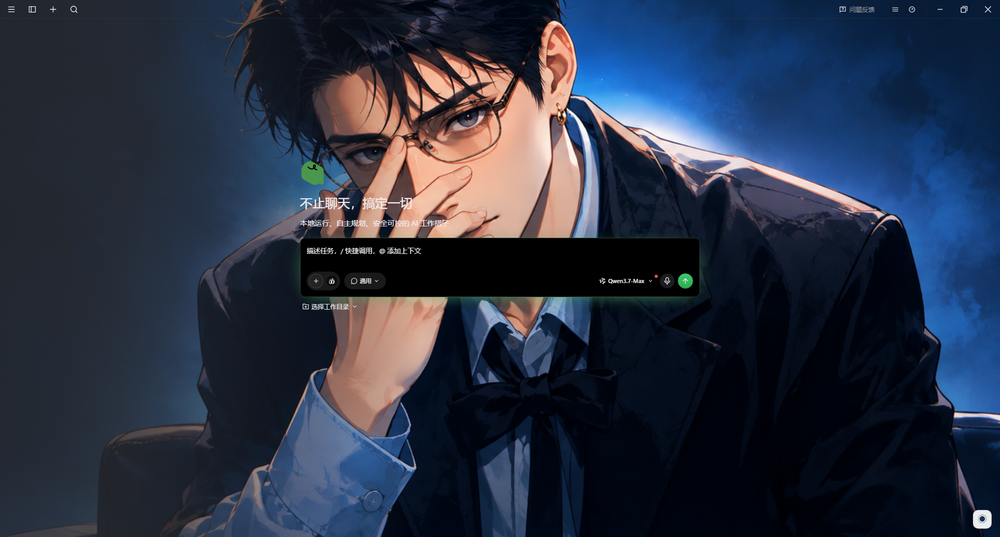
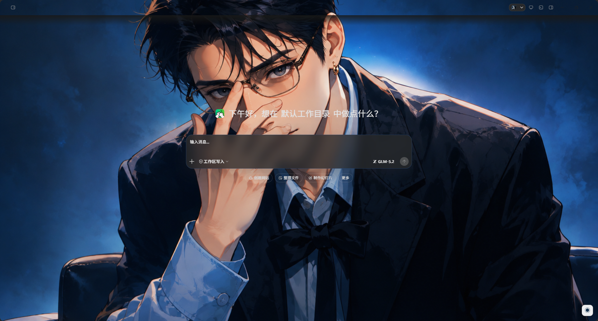
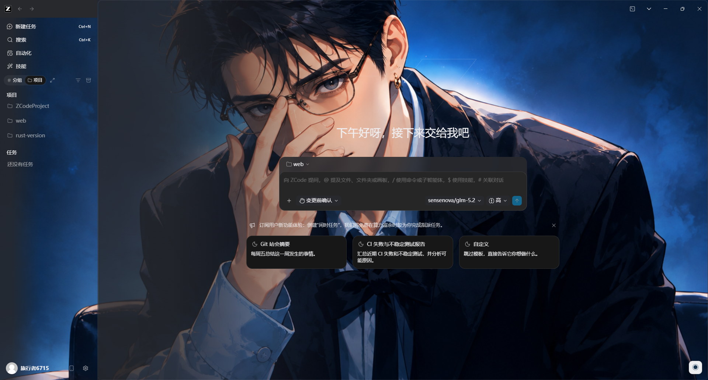
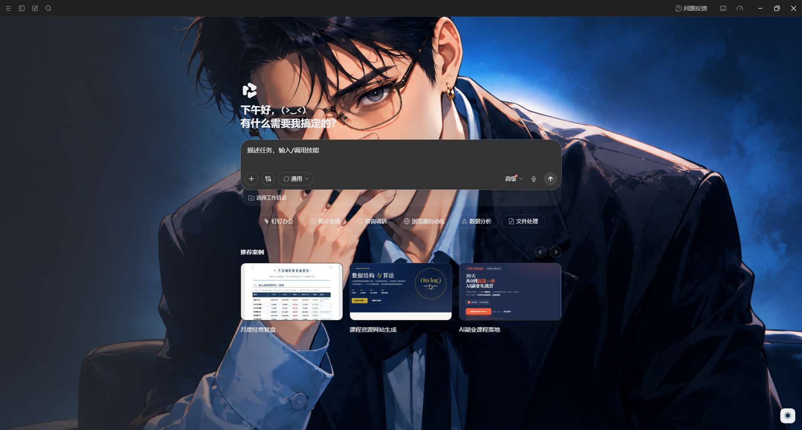
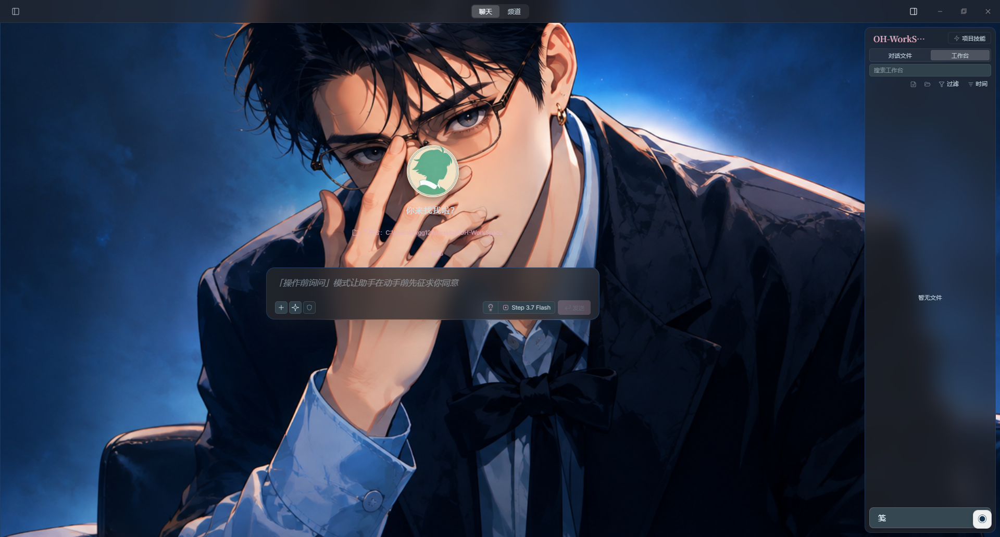

<h1 align="center">Dream Work Theme</h1>

<p align="center">
  <b>给 Electron Work 类应用换上你喜欢的主题 —— 不影响 Work 类应用功能使用</b>
</p>

<p align="center">
  <a href="LICENSE"></a>
  
  
  
</p>

<div align="center">

[简体中文](README.md) | [English](README_EN.md)

Dream Work Theme 是面向 Electron Work 类桌面应用的主题管理器。它负责发现已安装应用、以 Chrome DevTools Protocol（CDP）调试端口启动应用，并在运行时注入 CSS 和右下角主题菜单，不修改目标应用的 `.app / app.asar / WindowsApps`。

</div>

---

## 界面预览

<details>
<summary><b>点击展开截图展示</b></summary>















</details>

## 支持的应用

当前 `electron/manager/app-registry.ts` 注册了以下应用：

- WorkBuddy
- TRAE Work
- QoderWork
- CatPaw
- ZCode
- 千问办公（`QwenWorkCN`）
- HanaAgent
- Codex / ChatGPT Desktop

部分应用使用固定调试端口；QoderWork 和千问办公通过 `DevToolsActivePort` 获取运行时动态端口。HanaAgent 使用固定端口 `9346`，Dream Work Theme 会等待其 renderer 稳定后再注入主题。

## 应用功能

- 扫描常见安装路径并发现支持的应用。
- 根据应用兼容性筛选主题画廊。
- 切换应用时保留当前主题选择和主题分页。
- 以 CDP 调试端口启动或重启目标应用。
- 注入背景图、应用专属样式和浮动主题菜单。
- 显示应用进程、主题注入、菜单和当前主题状态。
- 还原目标应用原生主题。
- 创建 Windows、macOS 和 Linux 的「应用 + 主题」快捷方式。
- 构建 Windows、macOS 和 Linux 发布包。

## 环境要求

- Node.js 22 或更高版本
- pnpm
- 至少一个受支持的 Electron 应用

安装依赖：

```bash
git clone https://github.com/xxxhh336/dream-work-theme
cd dream-work-theme
pnpm install
```

Electron 二进制下载较慢或者出错，可先设置镜像：

```powershell
$env:ELECTRON_MIRROR="https://npmmirror.com/mirrors/electron/"
node node_modules/electron/install.js
```

## 本地开发

启动完整的 Vite + Electron 开发环境：

```bash
pnpm run electron:dev
```

`scripts/electron-dev.cjs` 统一管理开发进程：启动 Vite、等待 `dist-electron/main.js` 和 `dist-electron/preload.js` 就绪，然后只启动一个 Electron 实例。不要另外执行 `electron .`。

底层 Vite 命令仍可使用：

```bash
pnpm run dev
```

正常桌面开发应优先使用 `electron:dev`。`dev` 使用 vite-plugin-electron 的默认生命周期。

其他检查命令：

```bash
pnpm run typecheck
pnpm run build:app
```

Vite 的 CJS API deprecation 当前只是警告，不会导致构建失败。

## 使用流程

1. 启动 Dream Work Theme。
2. 选择一个已安装应用。
3. 选择兼容主题。
4. 点击「应用主题」。
5. 在「应用设置」中查看进程、注入、菜单和当前主题状态。
6. 在目标应用右下角使用浮动菜单切换或还原主题。

应用主题时，Dream Work Theme 可能会重启目标应用，以便加入 CDP 调试端口。主题只存在于运行时渲染进程，不会写入目标应用安装包。

右下角菜单最多显示 4 个快捷预置主题，不再固定绑定某几个主题 ID。Dream Work Theme 会按当前应用中的切换次数排序，次数相同时优先最近使用的主题；没有使用记录时从当前应用实际兼容的主题中补足，因此已删除或不兼容的主题不会显示空白入口。

- 使用频率按应用分别统计，同一主题在 HanaAgent、Codex 等应用中可以有不同排序。
- 从 Dream Work Theme 点击「应用主题」或从目标应用右下角菜单切换预置主题都会计数。
- 菜单初始化、HanaAgent renderer 重建、watcher 自动补注入、自定义图片切换和「还原主题」不会计数。
- 当前从 Dream Work Theme 应用的主题会进入本次菜单；后续菜单根据累计次数和最近使用时间重新排序。
- 使用记录保存在用户数据目录的 `theme-usage.json`。删除或停止兼容某个主题后，记录可以保留，但该主题不会出现在对应应用菜单中。

### HanaAgent 说明

- HanaAgent 启动期间可能重建 renderer。Dream Work Theme 会等待主 renderer 稳定，并在运行期间对新建或丢失主题的 renderer 自动补充注入。
- HanaAgent 使用稳定性优先的轻量菜单。右下角按钮的 `◉` 标识、尺寸和基础样式与其他应用一致，菜单打开后点击应用内其他空白位置会自动关闭。
- HanaAgent 的快捷预置主题与其他应用使用相同的高频排序规则，但使用次数按 HanaAgent 独立统计。
- HanaAgent 的自定义图片使用独立轻量实现，不直接复用曾导致崩溃的完整通用菜单脚本。支持 PNG、JPEG、WebP，导入后缩放压缩为 WebP、自动提取主题配色，最多保存 5 张，并支持切换和删除。
- 自定义图片由 Dream Work Theme 主进程集中保存到用户数据目录的 `custom-themes.json`，不依赖各目标应用相互隔离的 `localStorage`。在任一受支持应用上传或删除后，其他应用下次打开菜单或应用主题时会读取同一图片库。
- 当前选中的 HanaAgent 自定义图片会记录在本地，页面刷新或 renderer 重建后会自动恢复；从 Dream Work Theme 主动应用预置主题会覆盖该选择。
- 在 HanaAgent 右下角浮动菜单点击「还原主题」后，会记录用户的还原选择；守护器、页面刷新和 renderer 重建都不会再次自动显示主题。
- 需要重新启用主题时，可在 HanaAgent 浮动菜单选择一个主题，或回到 Dream Work Theme 点击「应用主题」。主动应用会清除还原状态。
- 从 Dream Work Theme 执行「还原主题」同样会停止 HanaAgent 的主题守护和持久注入，并保持原生主题。

## 主题存储

主题按以下优先级加载：

1. 用户主题：`app.getPath('userData')/themes`
2. 内置主题：`app.getAppPath()/themes`

Windows 常见路径：

```text
开发模式内置主题：%PROJECTDIR%\themes
打包版内置主题：  resources\app.asar\themes
更新的用户主题：  %APPDATA%\dream-work-theme\themes
```

打包后的 `app.asar` 是构建时快照。删除源码 `themes/` 中的主题，不会改变已经生成的 EXE；必须重新打包才能更新内置主题。

`app.asar` 在运行时只读，因此社区下载主题写入用户数据目录。相同 ID 时，用户主题优先于内置主题。

## 主题格式

源码主题目录至少包含：

```text
themes/<theme-id>/
├── theme.json
├── theme.css
└── hero.png、hero.jpg、hero.webp 或 hero.gif
```

示例：

```json
{
  "schemaVersion": 1,
  "id": "my-theme",
  "name": "我的主题",
  "author": "用户",
  "hero": "hero.png",
  "colors": {
    "accent": "#24c9d7",
    "secondary": "#ef8fd3",
    "surface": "#f7fbff",
    "text": "#17344f"
  },
  "apps": {
    "workbuddy": { "compat": true },
    "codex": { "compat": true },
    "trae-work": { "compat": true },
    "qoder-work": { "compat": true },
    "catpaw": { "compat": true },
    "zcode": { "compat": true },
    "qwen-office": { "compat": true },
    "hana-agent": { "compat": true }
  }
}
```

当前校验要求：`schemaVersion` 为 `1`，ID 只使用小写字母、数字和连字符，名称非空，hero 文件存在，并提供四个 `#RRGGBB` 颜色。

主题制作流程见 [skills/custom-theme-maker/SKILL_CN.md](skills/custom-theme-maker/SKILL_CN.md)。

## 目标构建

构建应用代码和当前宿主平台配置的发布包：

```bash
pnpm run build
```

### Windows

```powershell
pnpm run build:win
pnpm run build:win:x64
```

产物：

```text
dist\Dream-Work-Theme-<version>-win-x64.exe
dist\win-unpacked\Dream Work Theme.exe
```

NSIS 安装器会在安装前后删除无用的 `%LOCALAPPDATA%\dream-work-theme-updater` 安装器缓存。即使安装目录选择 D 盘，Windows 系统盘仍需承担临时解压空间。建议 C 盘至少保留 1 GB，否则安装可能中途停止并留下不完整目录。

### macOS

```bash
pnpm run build:mac
pnpm run build:mac:arm64
pnpm run build:mac:x64
```

生成带架构名称的 DMG 和 ZIP。macOS 发布包必须在 macOS 主机或 macOS CI runner 上生成。

### Linux

```bash
pnpm run build:linux
pnpm run build:linux:x64
pnpm run build:linux:arm64
pnpm run build:linux:deb
pnpm run build:linux:deb:x64
pnpm run build:linux:deb:arm64
```

在 Linux 上生成 `AppImage + deb + tar.gz`；在 Windows 或 macOS 上只生成 `tar.gz`。AppImage 和 deb 必须在 Linux 主机运行。

本地构建 deb 需要 `fpm`。Ubuntu/Debian 可先安装 Ruby，再执行 `sudo gem install --no-document fpm`。GitHub Actions 工作流会自动安装。

仅构建 AppImage：

```bash
pnpm run build:linux:appimage:x64
pnpm run build:linux:appimage:arm64
```

Linux 打包会同时产生 `linux-unpacked`、约 700 MB 的中间 tar 和最终压缩包，需要较大临时空间。`scripts/package-linux.cjs` 会清理失败残留、要求至少 2 GB 空闲空间，并在 Windows 上自动选择空闲空间最多的磁盘作为临时目录。可通过 `DREAM_WORK_BUILD_TEMP` 手动指定。

## GitHub Actions 自动发布

仓库包含 `.github/workflows/release.yml`：

- 推送到 `main`：构建 Windows x64、Linux x64、macOS x64/arm64，并更新 `nightly` 预发布。
- 推送 `v*` 标签：创建对应正式 Release，例如 `v0.1.0`。
- Actions 页面手动运行：不填写标签时更新 `nightly`；填写标签时创建或更新指定正式 Release。

手动运行时，GitHub 页面顶部的 **Use workflow from** 必须选择 `main`，然后在 `release_tag` 中填写例如 `v0.1.2`。工作流会从 main 构建，并临时将构建版本设置为输入标签对应的版本；不要在 **Use workflow from** 中选择旧版本标签。

正式发布示例：

```bash
git tag v0.1.0
git push origin v0.1.0
```

Release 包含 NSIS、AppImage、deb、Linux tar.gz、macOS DMG 和 macOS ZIP。GitHub 仓库需要允许工作流拥有 `contents: write` 权限；工作流已声明该权限，公开仓库通常无需额外 Secret。

## 项目结构

```text
dream-work-theme/
├── electron/
│   ├── main.ts
│   ├── preload.ts
│   └── manager/
│       ├── app-registry.ts
│       ├── cdp.ts
│       ├── discovery.ts
│       ├── injector.ts
│       ├── launcher.ts
│       ├── shortcuts.ts
│       ├── theme-paths.ts
│       ├── theme-store.ts
│       └── theme-updater.ts
├── renderer/
│   ├── App.tsx
│   ├── components/
│   └── pages/
├── scripts/
│   ├── build-electron.cjs
│   ├── electron-dev.cjs
│   └── package-linux.cjs
├── shared/types.ts
├── skills/custom-theme-maker/
├── themes/
├── build/installer.nsh
├── package.json
└── vite.config.ts
```

## 添加新应用

1. 在 `electron/manager/app-registry.ts` 添加进程名、安装路径、渲染页 URL 特征和端口策略。
2. 如果应用有特殊安装结构或动态端口，在 discovery/launcher 中补充处理。
3. 在 `electron/manager/injector.ts` 添加应用专属注入 CSS 与菜单行为。
4. 在主题 manifest 和社区主题转换中加入应用 ID。
5. 测试启动、应用、刷新状态、还原、辅助窗口和应用退出场景。

## 已知限制

- 主题注入存在于目标应用运行中的渲染进程，退出应用后运行时注入自然消失。
- 目标应用升级可能改变 DOM，需要更新注入选择器。
- HanaAgent 会在启动和部分界面切换期间重建 renderer，因此首次应用主题可能比其他应用多等待数秒。
- 未签名的 Windows/macOS 发布包可能触发系统安全提示。
- Windows 当前关闭了 EXE 元数据编辑，因此可能显示 Electron 默认图标和文件信息。
- 大量内置主题会显著增加安装包大小、构建时间和磁盘需求。

## 参考引用

- https://github.com/freestylefly/codex-themes
- https://github.com/Fei-Away/Codex-Dream-Skin
- https://github.com/shaozhengmao/workbuddy-dream-theme

## AI辅助

GLM、Codex、DeepSeek

## 许可证

Apache License 2.0
